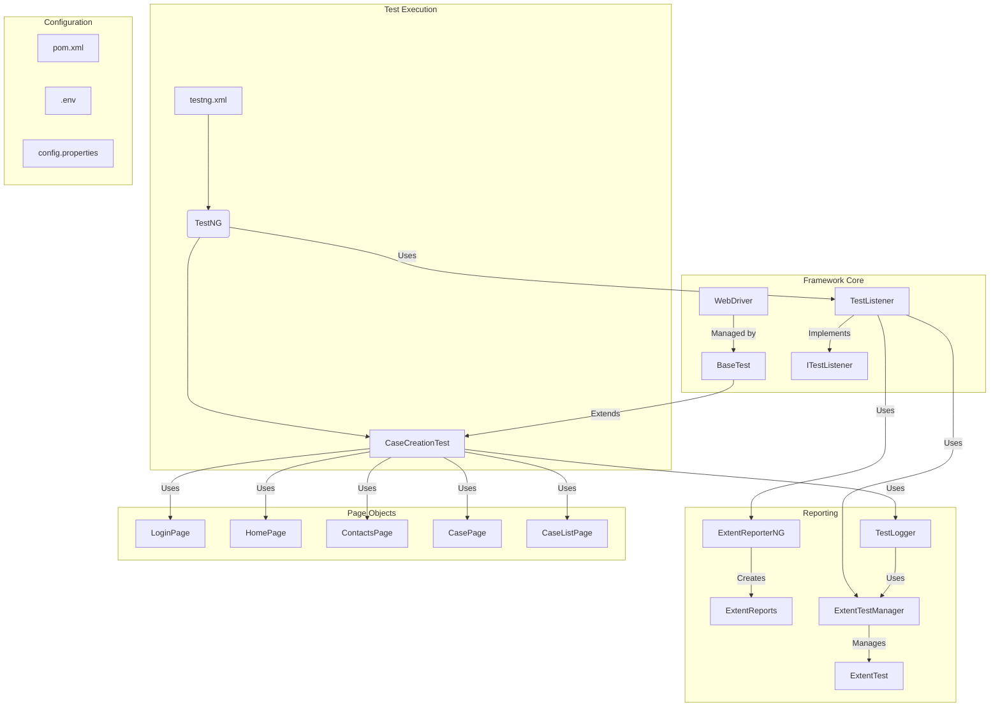

# Salesforce Case Creation Test Automation Framework

This project is a Selenium-based test automation framework for creating and verifying cases in Salesforce. It uses Java, Maven, and TestNG to automate the testing process and generates detailed Extent reports with screenshots.

## Table of Contents
- [Prerequisites](#prerequisites)
- [Setup and Installation](#setup-and-installation)
- [Running Tests](#running-tests)
- [Viewing Reports](#viewing-reports)
- [Framework Architecture](#framework-architecture)
- [Test Scenario Overview](#test-scenario-overview)
- [CI/CD Integration](#cicd-integration)
- [Runbook](#runbook)

## Prerequisites
- Java Development Kit (JDK) 17 or higher
- Apache Maven
- Google Chrome browser

## Setup and Installation
1.  **Clone the repository:**
    ```bash
    git clone <repository-url>
    cd SeleniumPOC
    ```
2.  **Create a `.env` file:**
    Create a `.env` file in the root of the project and add your Salesforce credentials:
    ```
    SALESFORCE_USERNAME=<your-username>
    SALESFORCE_PASSWORD=<your-password>
    ```
3.  **Install dependencies:**
    ```bash
    mvn install
    ```

## Running Tests
### Local Execution
To run the tests locally with the Chrome browser UI, execute the following Maven command:
```bash
mvn test
```

### Headless Execution
To run the tests in headless mode (without a browser UI), use the `headless` system property:
```bash
mvn test -Dheadless=true
```
This is the recommended mode for CI/CD environments.

## Viewing Reports
After the test run is complete, the Extent report can be found at `reports/index.html`. Open this file in your web browser to view the detailed test results, including step-by-step logs and screenshots.

## Framework Architecture
The framework follows a Page Object Model (POM) design pattern and is structured as follows:



-   **Test Execution:**
    -   `testng.xml`: Defines the test suite and points to the test classes to be executed.
    -   `TestNG`: The core testing framework that orchestrates the test execution.
    -   `CaseCreationTest`: The test class that contains the actual test logic.
-   **Framework Core:**
    -   `BaseTest`: A base class that handles WebDriver setup and teardown. `CaseCreationTest` extends this class.
    -   `WebDriver`: The Selenium WebDriver instance for browser interaction.
    -   `TestListener`: A TestNG listener that captures test status and logs information to the Extent report.
-   **Reporting:**
    -   `ExtentReporterNG`: A utility class to configure and create `ExtentReports` instances.
    -   `ExtentTestManager`: Manages `ExtentTest` objects in a thread-safe manner.
    -   `TestLogger`: A utility class to log test steps and capture screenshots.
-   **Page Objects:**
    -   `LoginPage`, `HomePage`, `ContactsPage`, `CasePage`, `CaseListPage`: These classes represent the pages of the Salesforce application and encapsulate the web elements and actions performed on those pages.
-   **Configuration:**
    -   `pom.xml`: The Maven Project Object Model file that defines project dependencies and build configurations.
    -   `.env`: A file to store sensitive information like usernames and passwords.
    -   `config.properties`: A file for storing application-specific configurations like URLs.

## Test Scenario Overview
This test automation framework is designed to validate the case creation and owner assignment functionality in Salesforce. The primary test scenario, `testCaseCreation`, executes the following steps:

1.  **Login:** The test starts by logging into Salesforce using the credentials provided in the `.env` file. The `LoginPage` class handles the login process.
2.  **Navigate to Contacts:** After a successful login, the test navigates to the Contacts page using the `HomePage` class.
3.  **Select a Contact:** The test then selects a specific contact, "John Smith," from the contacts list using the `ContactsPage` class.
4.  **Create a New Case:** A new case is created for the selected contact. The `ContactsPage` is used to initiate the case creation, and the `CasePage` handles the process of filling out the case details and saving it.
5.  **Verify Case Creation:** The test retrieves the newly created case number from the `CasePage`.
6.  **Search for the Case:** The test navigates to the Cases list page and searches for the newly created case using the `CaseListPage` class.
7.  **Change Owner and Verify:** The owner of the case is changed, and the test verifies that the owner has been updated correctly by asserting the owner's alias. This is handled by the `CaseListPage`.
8.  **Open the Case:** Finally, the test opens the case to ensure it is accessible.

Throughout this process, the `TestLogger` class is used to log each step and capture screenshots, which are then included in the Extent report for detailed analysis.

## CI/CD Integration
This project includes a GitHub Actions workflow for continuous integration. The workflow is defined in `.github/workflows/ci.yml` and performs the following steps:

1.  **Checkout Code:** Checks out the latest code from the repository.
2.  **Set up JDK:** Sets up the specified Java version.
3.  **Build with Maven:** Compiles the project and downloads dependencies.
4.  **Run Tests:** Executes the tests in headless mode.

### GitHub Secrets
The workflow requires the following secrets to be configured in your GitHub repository settings:

-   `SALESFORCE_USERNAME`: Your Salesforce username.
-   `SALESFORCE_PASSWORD`: Your Salesforce password.

To add these secrets, navigate to your repository's **Settings > Secrets and variables > Actions** and create new repository secrets.

## Runbook

### Common Issues and Solutions

**1. `IllegalAccessError` during Maven compilation**
-   **Symptom:** The build fails with an error message similar to `java.lang.IllegalAccessError: class lombok.javac.apt.LombokProcessor ... cannot access class com.sun.tools.javac.processing.JavacProcessingEnvironment`.
-   **Cause:** This error occurs when using Lombok with Java 9 or later due to the Java Platform Module System's encapsulation.
-   **Solution:** The `pom.xml` has been configured with the `maven-compiler-plugin` to include the following argument, which resolves the issue:
    ```xml
    <compilerArgs>
        <arg>--add-exports</arg>
        <arg>jdk.compiler/com.sun.tools.javac.processing=ALL-UNNAMED</arg>
    </compilerArgs>
    ```

**2. Test fails with `NoSuchElementException`**
-   **Symptom:** The test fails because it cannot find an element on the page.
-   **Cause:** This can be due to several reasons:
    -   The page did not load completely before the test tried to interact with an element.
    -   The element locator is incorrect or has changed.
    -   The element is inside an iframe.
-   **Solution:**
    -   Ensure that appropriate waits (implicit or explicit) are used to handle page load times.
    -   Verify that the element locators in the page object classes are correct.
    -   If the element is in an iframe, switch to the iframe before interacting with the element.

**3. Report does not contain screenshots**
-   **Symptom:** The test report is generated, but it does not include screenshots for the test steps.
-   **Cause:** The `TestLogger.log()` method was not called, or there was an issue with the screenshot capture process.
-   **Solution:**
    -   Ensure that `TestLogger.log()` is called at each significant step in the test case.
    -   Check the console output for any errors related to screenshot capture.